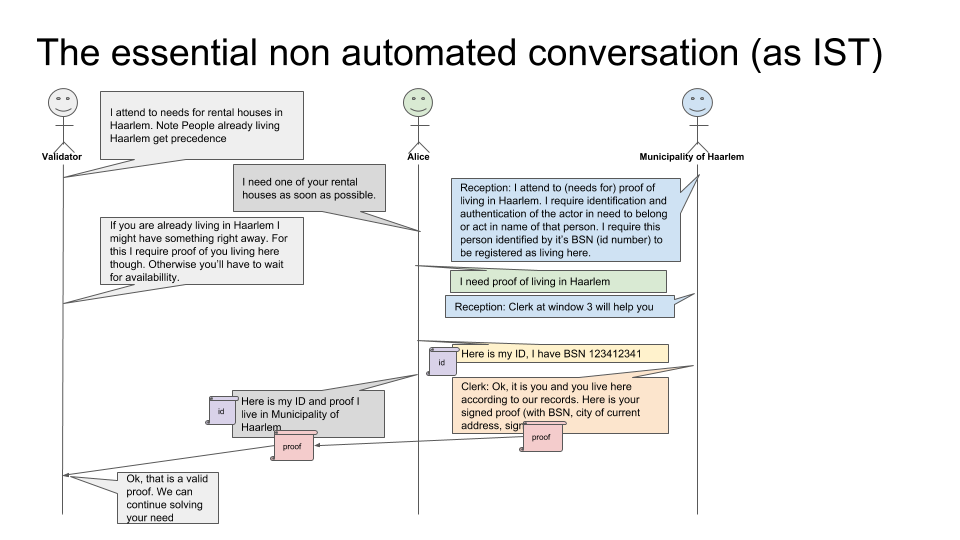
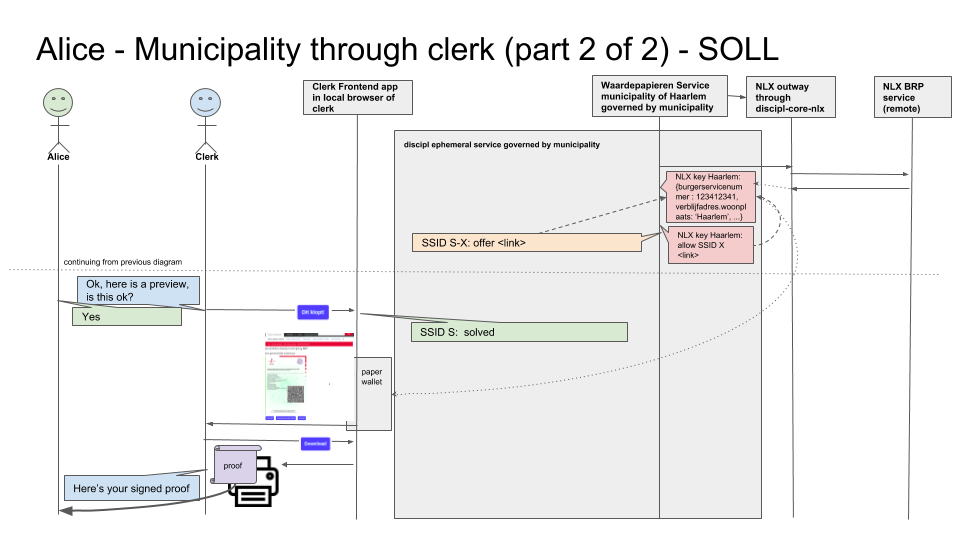
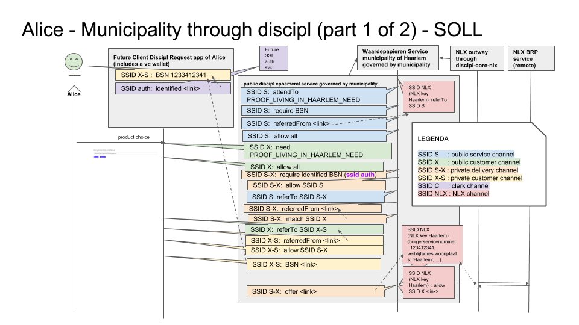

# Discipl Waardepapieren, Solution Architecture

## Introduction

The Discipl Waardepapieren (in english "Proofs") solution aims at a W3C Verifiable Credentials (see https://w3c-ccg.github.io/) compatible solution for issuing, holding and validation of credentials of citizens or even more generally: any signed information issued by an entity, for instance a municipality. Citizens are not to be required to have any equipment which implies it should still be possible for a credential to be issued to a “paper wallet” being a QR code printed on paper holding the credential data and signature of the issuer. The solution is based on the Discipl (http://discipl.eu) architecture and software stack which is open source and free to use and platform agnostic.

This project is a follow up on the one in 2018 (http://github.com/haarlem/digitale-waardepapieren). The main difference is that even no derivations of data often containing personal information in the form of peppered hashes are stored in public distributed ledgers like IOTA as this is never to be considered a safe and thing to do in relation to privacy assurance and is prohibited by law. Instead the information is signed and given to the citizen and the signed information is enough to validate the information as been signed by the issuer given that an official public key is used which is officially published in public. For this the official keys issuers can get through the NLX platform (nlx.io) is used for signing. The NLX platform is also used to connect to the sources of the data to be signed. By doing so, the act of requesting data to be issued is logged in relation to a specific purpose of this act and often in relation the person the information is about such that these subjects can get insight into these issuing acts through NLX Insight. Also this project does not aim at a proof of concept or prototype but a real working solution that can be put into production.

The initial focus is to use a (legacy) data source through NLX as source of the information to be issued and a custom made 'paper wallet' solution as verifiable credential platform. The architecture prepares for usage of other platforms instead of this in the future like IRMA and  prepares for integration into automated needs matching services envisioned within Discipl.

This document describes a high level solution architecture with software components as most detailed level and following ISO-42010 and NORA five layer model in a most pragmatic lean way intended to be readable for all stakeholders involved.

Note: expect this document to change as it is work in progress.

## Foundational layer

The solution might need to be compliant with the following laws, architectures and regulations:

- NORA / GEMMA, and all implications from this though noteworthy:
- EIF/EiDAS
- GDPR
- EN 301 549 / WCAG 2.0 (accessibility)
- ETSI TS 103 171 (XAdES) for paper wallet signatures
- BIR2017 (security management)
- REGULATION (EU) No 910/2014 (as far as applicable)

Note that the core waardepapieren solution itself does not implement or include identification / authentication services for citizens
nor any key distribution mechanism which is more dependent on it's integration and the specific platforms being used.

As for NORA and GEMMA, Discipl aims at a new innovative architecture to be integrated in NORA in the Future, aiming at a society that is facilitated with a hybrid distributed linked data landscape that aligns with concepts like attribute based credentials and self sovereign identity. And something that is called "Common Ground" is a similair innovation program for GEMMA. This is why we take the liberty to aim the solution to adhere to the principles of Discipl and common ground over those articulated in NORA and GEMMA and defer the identification and resolution of possible discrepancies within these principles to the ongoing development of discipl, common ground (including NLX).

As NLX aims at conforming to EIF/EiDAS and by having the waardepapieren solution use this platform for information retrieval and the NLX certificates for signing (and validation) and by having it not include the identification / authentication of actors, this solution quite automaticly adheres to EIF/EiDAS.

As already mentioned, the solution does not store any personal information on ledgers. All information retrieved through NLX are only held temporarily in memory to be able to issue the information to the holder of the requested credential, often being the subject of the information. Though in practice the holders also can be actors that are allowed to retrieve proofs for subjects other then themselves, for instance notaries, we focus on the case where the holder is the subject itself and defer other types of holders to the integration projects of the waardepapieren solution. The reason for this is that Discipl can easily support these alternative authorizations. By doing so, as long as the issuer and validating actor complies to GDPR in relation to the information subject, so does this solution. The waardepapieren solution helps complying to GDPR by holding information only temporarily and in encrypted state. The software is open source and is to be independently audited on the topic of security.

As for the ETSI TS 103 171 standard we see a need for a similar standard based on JSON and possibly one that better aligns with a data landscape that holds public keys in official distributed ledgers in the open apart from signed data shared privately. Though it is easy to create a XaDES export of any verifiable proof created from the waardepapieren solution, we do not see a direct need for this however for this project in it's current stage and also defer this topic to ongoing development of Discipl.

By using NLX certificates for signing and information retrieval, the waardepapieren service will align with REGULATION (EU) No 910/2014 for a large extend, the rest of which is to be deferred to the ongoing development of Discipl like as with ETSI TS 103 171.

The Waardepapieren solution should adhere to EN 301 549 / WCAG 2.0 though this is largely dependent on the integration of the solution in the user interfaces at the side of the issuer and not the solution itself. The project does involve the implementation of a reference validator app  / wallet however which must adhere to EN 301 549 / WCAG 2.0.

As said, the solution also aims at a W3C verifiable credential compliant solution. This compliancy is deferred to the ongoing development of Discipl however. The solution adheres to the main mandatory concepts of this and related standards however.

## Organisational layer

The following stakeholders are identified:

- issuer : automated (abundance) service available at location of issuer and/or through its website
- clerk : employee that helps a client at location of issuer, services, identifies and authorizes the client manually
- authorization service : automated service that identifies and authorizes client when client self services him/herself and accesses issuer through website
- client : person in need of verifiable information required by a validator. It also becomes a holder of the resulting signed information.
- validator : actor that needs to receive / verify information from client
- administrator : actor that controls and monitors the automated issuer service

An example of the essential conversation between real people as actors that would take place
in the use cases the waardepapieren solution facilitates is given below:

In essence this is the very proces that also takes place when retrieving a proof through the waardepapieren solution as can be seen below in the other verifiable claim sequence diagrams.

## Information layer

All information is temporarily held in verifiable claim channels on the so called discipl ephemeral platform (http://github.com/discipl/discipl-core-ephemeral) in memory. This platform will enforce access rights denoted by the channel owner in specific allow claims within the channel, so by default all channels are only accessible to the channel owner holding a corresponding private key created and temporarily held by the channel owner.Of course the party hosting the ephemeral server and it's administrator needs to be trusted also, but as this is the issuer as source of the information it is by definition a party already trusted with this information by the client.

The following channels will be created using this solution holding the following information (verifiable claims) with what kind of accessibility retention:

1) public service channel of issuer, destroyed at service shutdown
  - that a service with some id is attending to needs for what : (ssid, attendTo, what)
  - (possibly a log of needs that has been attended to)
2) public customer channel of client, destroyed after solving the need or at max for X minutes or service shutdown whatever comes first
  - that an anonymous client with some id is in need for what : (ssid, need, what)
3) private customer channel, destroyed after solving the need or at max for X minutes or service shutdown whatever comes first
  - that the client refers to a certain BSN number for this. (ssid, BSN, bsn-number)
  - that the client allows access to this channel to issuer
  - that the client attests the information prepared by the issuer in the delivery channel to be true
  - that the client successfully got the signed information in the format it wants by denoting the need as solved
4) private delivery channel of issuer, destroyed after solving the need or at max for X minutes or service shutdown whatever comes first
  - that a service with some id is attending to a single specific need that has been noticed for what : (ssid, attendTo, what)
  - all the information the issuer has prepared to issue, taken from the NLX result channel
  - that the specific client in need is allowed to access this channel
  - that it matches a specific need for that same what
  - that it attests (with signature using NLX outway key) the information to be issued
5) clerk / auth svc channel, held in memory until read or at max for X minutes or service shutdown whatever comes first
  - that the client has been identified / authenticated (and authorised) to retrieve the product in relation to the BSN (or other source argument configured) denoted in a given BSN claim in the private customer channel
6) private NLX channel of issuer, held in memory until read or at max for X minutes or service shutdown whatever comes first
    - the result of a NLX call stored in the channel of and thus signed with the NLX certificate of the issuer (every claim specifically allowed to specific other actors)
7) validation channel of validator, destroyed after validation or service shutdown whatever comes first
      - the same claim and attestation pair as was issued from the delivery channel of the issuer, read from the QR code on a piece of paper

besides these channels, information is issued and stored in supported verifiable credential platforms (in privately held wallets of the client as holder). For now only a custom paper wallet platform is used which stores an attested claim in a QR code printed on a piece of paper to be owned by the client. This piece of paper shall also contain the raw information contained in the attested claim in the QR code which limits the amount of data that can be held in claims such you can issue them in a paper wallet.

The solution just presents, signs and issues information as returned as result from the NLX call; for now it does not semantically parses this information. For now, the webservice called through NLX needs to accept a BSN number as argument that identifies the client though these kinds of arguments are configurable. The object of what is needed or attended to is something configured by the issuer like 'Uittreksel-GBA-Haarlem'. All other data results from usage of the abundance service api and discipl core api and the connectors used (ephemeral and NLX for now).

The above is illustrated in so called verifiable claim sequence diagrams below:

## Application layer

The solution is mainly hosted on a central Discipl ephemeral server application hosted by the issuer to which
multiple client applications (for clients, issuer and administrator) connect to (through the client side Discipl core api).

The issuer runs a waardepapieren service on this server that sets up the ephemeral server and connects to this to attend to needs expressed by other clients on this platform. The following other client applications connect to this ephemeral service hosted by the issuer:

- clerk-frontend
- authorisation-service
- client-frontend
- adminstrator-frontend

Validation does not require usage of this server; validators run their own embedded local ephemeral service (without client-server communication) just to hold information temporarily and use it for their own validation process executed within a client side validation app. As NLX certificates in the end are to originate from official root certificates (conform EiDAS/EIF), validation for now just involves standard techniques around X.509 certificates and can even be done offline.

Below is a more detailed component view:

## Infrastructural layer

The solution is hosted on server(s) in control of the issuer and used by the devices (broad range of desktop computers, mobile phones or tablets) in control of citizens, clerks, validators and administrators. The server at the issuer is accessible on the intranet of the issuer and publicly through an existing web server (in a controlled way through a reverse proxy) that also will serve the client side web application.

To enable easy integration, the waardepapieren service along with a nlx outway are available as docker containers as well as examples of integrations of the clerk and client front end applications. All these can be started using docker compose. The service and front end applications are configurable from a single configuration file. The amount of code to create to integrate the solution in to website / backoffice
is made as minimal as possible.

## Key decisions

- scope : the waardepapieren service will at least provide in a single product that can be issued.
- scope : the information being signed is that of the result data of a NLX call given the BSN number as argument though this argument is configurable
- scope : only the paper wallet is in scope as supported verifiable credential solution
- scope : identification and authentication is performed either by the clerk-frontend user in the local intranet the waardepapieren service runs in, or through the authentication service integrated within the website through which the service is made accessible. The validation app autenticates a proof through well established techniques around X.509 certificates issued conform EiDAS/EIF.
- scope : the topic of alignment with W3C Verifiable Credential standard, ETSI TS 103 171 and REGULATION (EU) No 910/2014 is deferred to ongoing development of Discipl

## Future directions

The solution is prepared to be used in different kind of situations and set ups and use cases in which other types of platforms can be used instead of ephemeral, NLX or paper wallet. The idea is that it is prepared for usage in automated facilitation in requirement resolving in which for instance when a client needs something that requires a signed proof of some issuer, the proof can be automatically and conveniently requested as need
and once issued by the issuer to the client provided by the client to the validator, identifying themselves through future self sovereign identity solutions from within all kinds of solutions developed independently from the service provided by the issuer. In that situation the solution is used in the way as denoted in the verifiable sequence diagrams below:

